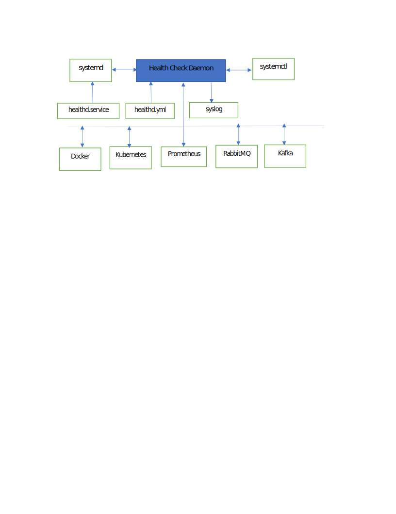

# Epiphany Health Monitor service design proposal

Affected version: 0.6.x/0.7.x

## Goals

Provide service that will be monitoring components (Kubernetes, Docker, Kafka, EFK, Prometheus, etc.) deployed using Epiphany.

## Use cases

Service will be installed and used on Virtual Machines/Bare Metal on Ubuntu and RedHat (systemd service). Health Monitor will check status of components that were installed on the cluster. Combinations of those components can be different and will be provided to the service through configuration file.

Components that Health Monitor should check:

- Kubernetes (kubelet)\*
- Query Kubernetes health endpoint (/healthz)\*
- Docker\*
- Query Docker stats\*
- PostgreSQL
- HAProxy
- Prometheus
- Kafka
- ZooKeeper
- ElasticSearch
- RabbitMQ

\* means MVP version.

Health Monitor exposes endpoint that is compliant with [Prometheus metrics format](https://github.com/prometheus/docs/blob/master/content/docs/instrumenting/exposition_formats.md#text-format-example) and serves data about health checks. This endpoint should listen on the configurable port (default 98XX).

## Design proposal

**Health Checks**

Platform Health checks are a means of regularly monitoring the health of individual components within the Epiphany environment. These monitoring probes checks the liveness of containers, services, processes at specified intervals and, in the event of an unhealthy object take predefined action.

**Health Check Daemon (healthd)**

healthd is an Epiphany Linux based service process providing health check probes, this process is instantiated at system startup, managed and supervised by the service manager (Systemd), and runs unobtrusively in the background throughout its lifecycle. Initial support will be provided for the following Linux based distros:

- CentOS 9
- Ubuntu 18.04
- Redhat 7.6

The Health Check Daemon will implement Linux D-Bus IPC framework  protocol (sd\_notify) as defined [https://www.freedesktop.org/software/systemd/man/sd\_notify.html#Description](https://www.freedesktop.org/software/systemd/man/sd_notify.html#Description)for new daemons, which provides robust mechanism for Daemon management and control using systemctl.

**sd\_notify()**

Will be used by the daemon service to notify the service manager (systemd)  about state changes and allow systemctl to inquiry/stop/stop the Health Check Daemon.

The following sd\_notify() states will be initially supported:

- **READY** Informs the service manager that service startup is finished, or the service finished loading its configuration.
- **RELOADING** Informs the service manager that the service is reloading its configuration. This is used to allow the service manager to track the service&#39;s internal state and present it to the user.
- **STATUS** Passes a single-line UTF-8 status string back to the service manager that describes the service state. This is free-form and will be used to convey state, status and last error condition back to the user.
- **STOPPING** Informs the service manager that the service is beginning its shutdown. This is used to keep the service manager aware of orderly process shutdown.

**healthd.service File**

Service manager .service file will be used to define the Health Check daemon process, which is managed by the service manager. The directory **/etc/systemd/system** contains the system units created and managed by systemd and will contain the service file healthd.service, which specifies the Health Check daemon.

**Syslog**

System Logging (syslog) will be used to provide standard informational, error, and warning message logging of event messages generated from healthd.

**healthd.yml**  **Config**

The Health Check Daemon configuration file format will be based upon YAML to provide key-value pairs in human-readable format.

| **Key** | **Description** | **Value** |
| --- | --- | --- |
| Name | Specifies the associated application name | User defined string |
| Package | Specifies the Golang package name. | Currently supported HTTP, Docker and Prometheus. |
| Interval | Specifies the probe interval in seconds. | \&gt;= 5. Default 10. |
| Retries | Specified the number of times to retry probe after first failure. | \&gt;= 3. Default 7. |
| RetryDelay | Specifies delay time in seconds between retry attempt. | Must be greater than 3 seconds. |
| ActionFatal | Specifies whether to KILL associated DAEMON. | True/false default false |
| IP | Specifies IP address of associated probed daemon. | Optional. |
| Port | Specifies the associated IP address port number associated with probed daemon. | Optional |
| Path | Consist of a sequence of path segments separated by a slash (/) | Optional |
| RequestType | Specifies the HTTP method to be used for probing associated daemon. | head, get, put, and  post. Default head. |
| Response | Specifies the associated good response &quot;200 Ok&quot;. | Optional, default 200. |

Env:

dockerd:
  -Package: docker,
  
  -Interval: 5,
  
  -Retries:  7,
  
  -RetryDelay: 3,
  
  -ActionFatal: True,
  
  -IP: 127.0.0.1,
  
  -Port: 8080,
  
  -PATH: /,
  
  -RequestType: HEAD,
  
  -Response: 200

**Packages**

Golang packages will be used to implement each client interface and provide liveness probe. Initial support will be provided for the following probes:

1. **HTTP Probe** Probably the most common liveness probe used to provide client-side HTTP liveness and will be used to send a valid HTTP request per yaml Config. It&#39;s z light weight HTTP API package that will provide interrogation of response code for valid responses typically 200 or 300 range.
2. **Docker Probe** Docker provides an API for interacting with the Docker daemon. The Docker API will be used to provide the client-side interface to containers. The API will be used to query all containers using the &quot;list container&quot; service. This client will interrogate the results returned for stopped/abnormal containers and take the appropriate action.
3. **Prometheus** Client API will be used to provide metric (TBD) to provide instrumentation via predefined or default endpoint and send current state of all tracked metrics assigned to individual liveness probes.
